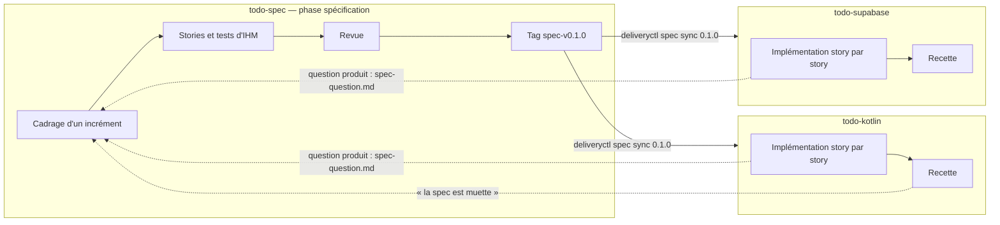
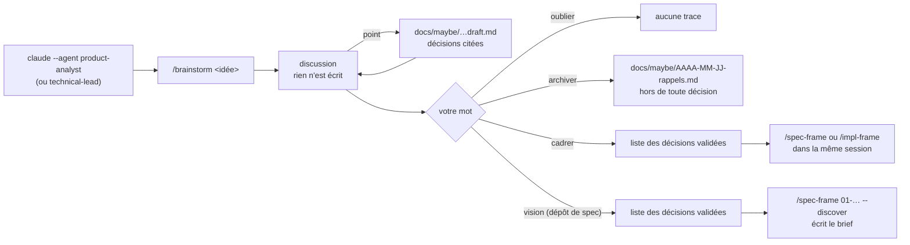
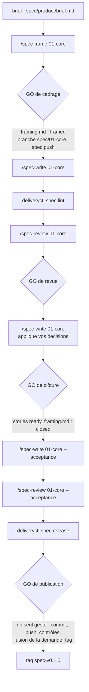
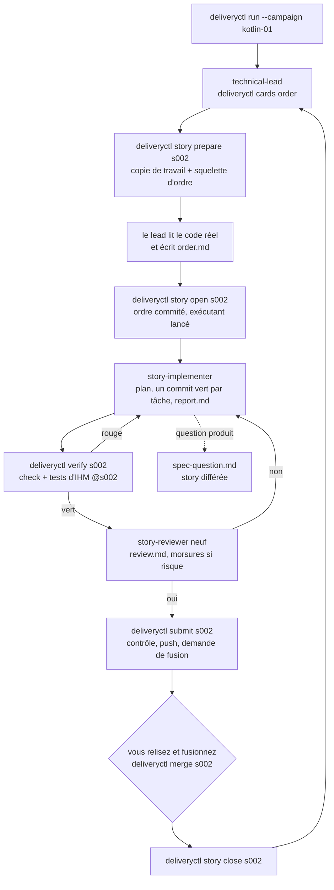
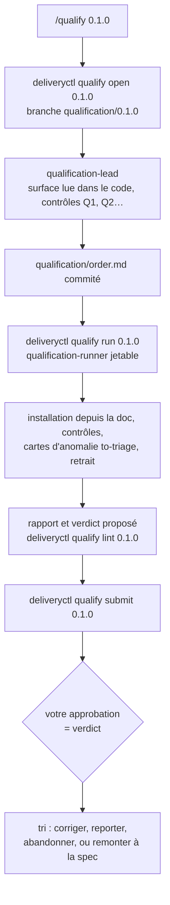
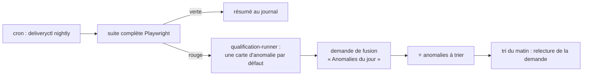

# Guide : une spec, deux implémentations

Ce guide suit la méthode de bout en bout sur un cas concret : une liste de tâches (TODO) spécifiée
une fois, puis implémentée deux fois, sur deux piles différentes. Pour chaque phase : un schéma,
puis les commandes du plugin (tapées dans une session Claude) et celles du moteur `deliveryctl`
(tapées dans le shell). Les formats exacts sont dans [`CONTRACTS.md`](../CONTRACTS.md).

## Le cas : trois dépôts

| Dépôt | `repo_role` | Contenu |
|---|---|---|
| `todo-spec` | `spec` | la spécification, neutre en technologie, et sa suite de tests d'IHM Playwright |
| `todo-kotlin` | `impl` | une implémentation Kotlin (Ktor, pages Thymeleaf et HTMX) |
| `todo-supabase` | `impl` | une implémentation Next.js et Supabase |

Les stories de la spec : `s001 : Se connecter`, `s002 : Créer une liste`,
`s003 : Gérer les tâches d'une liste`, `s004 : Partager une liste`,
`s005 : Synchroniser en direct`, `s006 : Rappeler les échéances`.



La spec est la même pour les deux implémentations : chaque dépôt `impl` en garde une copie exacte
d'une version publiée (`spec/` et `spec.lock`), et la même suite de tests d'IHM juge les deux.
Aucun agent n'écrit dans un autre dépôt : une question produit remonte par un fichier que vous
portez au cadrage suivant.

## 0. Équiper les trois dépôts

Les trois premières lignes se font une fois par machine ; ensuite, équiper un dépôt est un seul
geste, `deliveryctl init`, qui ne pose aucune question :

| Où | Commande | Effet |
|---|---|---|
| shell | `claude plugin marketplace add peugene/delivery-method` | déclare la marketplace |
| shell | `claude plugin install delivery-method@delivery-method` | installe le plugin pour l'utilisateur |
| shell | la fonction `deliveryctl` du README (« Raccourci dans le shell ») | fait marcher `deliveryctl` hors d'un dépôt équipé, donc `init` comme premier geste |
| shell | `mkdir todo-spec && cd todo-spec && deliveryctl init spec` | équipe `todo-spec` (disposition `spec`) |
| shell | `deliveryctl init impl todo-spec todo-kotlin` | équipe `todo-kotlin` : crée le dossier et le dépôt, disposition `impl`, dépôt de spec `todo-spec` (écrit en `spec_source`) |
| shell | `deliveryctl init impl todo-spec todo-supabase` | de même pour `todo-supabase` |

`init` déduit tout ce qu'il peut : la langue et la visibilité viennent des réglages de machine
(`language`, `visibility`, privé par défaut ; `--public`, `--private` ou `--internal` les
remplacent), la forge de `origin` ou du réglage `forge`, les commandes du `justfile`. Il affiche
un résumé de huit lignes au plus (dossier, dépôt à créer sur GitHub ou GitLab, disposition,
adresse git, branche du commit, protection) et attend un seul « o » ; `--dry-run` montre ce
résumé sans rien écrire. Sur ce « o », il crée le dépôt sur la forge, règle l'adresse privée de
GitHub pour un dépôt public, pose `delivery.toml`, `.delivery/`, la copie des agents, skills et
commandes sous `.claude/` (commandes sans espace de noms : `/spec-frame`…), `CLAUDE.md`,
`.claude/settings.json`, `.gitignore`, `justfile` et la CI (un squelette `spec/` pour
`todo-spec`), commite, pousse, protège la branche par défaut et lance `doctor`. Dans une session
Claude, `/delivery-method:init spec` fait de même. Il n'y a rien à relire avant de commiter : tout
l'est déjà.

Le `justfile` de `todo-spec` marche d'emblée (`just check` lance `spec lint`). Ceux de
`todo-kotlin` et de `todo-supabase` échouent tant que la pile ne les définit pas : `/impl-frame`
en propose les quatre recettes (Gradle pour l'un, npm et Supabase en local pour l'autre) et les
lignes d'installation de la CI.

## Explorer une idée, à n'importe quelle phase

Avant qu'une idée devienne du travail, vous pouvez y réfléchir avec Claude sans rien engager :
aucune mémoire, aucune note, aucun fichier pendant la discussion, sauf le brouillon d'un point
que vous demandez (voir plus bas). Claude reformule l'idée, donne un avis franc, propose deux ou
trois angles, puis avance à votre rythme, une ou deux questions par tour. La discussion se clôt
sur votre mot.

**Deux objectifs.** Le brainstorm s'ouvre en annonçant son objectif. *Ciblé* (par défaut) : étroit
et profond, court, une idée. *Vision* (`/brainstorm --vision <idée>`) : large et peu profond, une
longue session : à qui s'adresse le produit, le problème, quelques principes, les grands blocs
dans l'ordre. Si vous plongez dans le détail d'une fonctionnalité, Claude propose de la mettre de
côté pour un brainstorm ciblé et la note, au lieu de creuser. Dans un dépôt de spec dont le
brief est vide (que des titres, des commentaires et des marqueurs) et sans story, Claude propose
la vision en une phrase. L'objectif règle la conduite, jamais la clôture.

**Le point d'enregistrement.** Une longue session est résumée automatiquement, et ce résumé peut
paraphraser ou perdre vos mots exacts, alors que le cadrage doit les citer. Dites « point » :
Claude écrit `docs/maybe/<date>-<slug>.draft.md`, réécrit en entier à chaque point, avec vos
décisions validées citées mot pour mot, puis les pistes écartées, les questions ouvertes et les
sujets mis de côté. En vision, Claude en propose un après plusieurs décisions validées ou avant de
changer de sujet ; en ciblé, seulement à votre mot. Le brouillon n'est pas suivi par git. Pour
reprendre, nommez-le : `/brainstorm docs/maybe/<…>.draft.md`. À la clôture, il est supprimé :
« oublier » ne garde rien, « archiver » l'intègre à l'archive, « cadrer » et « vision » en citent
les décisions.

**Lancez le brainstorm dans la session qui cadrera.** Une session ne voit pas la conversation
d'une autre, et `/spec-frame` ne s'ouvre que dans la session de l'analyste produit,
`/impl-frame` que dans celle du lead technique : ailleurs, ils affichent la commande qui ouvre la
bonne session et s'arrêtent. Pour une idée produit, dans le dépôt de spec, ouvrez donc
`claude --agent product-analyst` ; pour une idée technique, dans un dépôt d'implémentation,
`claude --agent technical-lead`. Au mot « cadrer », Claude liste les décisions que vous avez
validées, citées mot pour mot ; vous tapez alors la commande de cadrage dans la même session,
qui part de ces décisions. « Vision » (dépôt de spec seulement) fait de même, mais pour le brief :
voir la phase spécification. Dans un dépôt d'implémentation, la vision technique est
`docs/architecture.md`, cadrée par `/impl-frame` : « vision » n'y est pas proposé.



| Où | Commande | Effet |
|---|---|---|
| shell | `claude --agent product-analyst` (idée produit) ou `claude --agent technical-lead` (idée technique) | ouvre la session qui cadrera ; `claude` suffit pour une idée que vous ne pensez pas cadrer |
| cette session | `/brainstorm [--vision] <idée>` | ouvre la discussion, ciblée ou vision |
| même session | « point » | écrit ou réécrit le brouillon `docs/maybe/<date>-<slug>.draft.md` (non suivi par git) |
| même session | « oublier », « archiver », « cadrer » ou « vision » | clôt : rien, une archive, ou la liste des décisions validées (« vision » : dépôt de spec seulement) ; le brouillon est supprimé |
| même session | `/spec-frame <incr>` ou `/impl-frame <campagne>` | après « cadrer » : ouvre le cadrage avec ces décisions |
| même session | `/spec-frame 01-… --discover` | après « vision » : l'analyste demande le nom court du premier bloc, puis écrit le brief avec ces décisions et cadre ce bloc |
| shell | `git add docs/maybe/… && git commit` | garde l'archive, si vous le voulez ; le commit est votre geste |

Si le brainstorm a lieu dans une autre session, une session ordinaire par exemple, dites-y
« cadrer » (ou « vision ») avant de la quitter et copiez la liste. Ouvrez ensuite la session de
l'analyste ou du lead technique, tapez la commande de cadrage et collez la liste à sa suite :
elle seule passe, ni la discussion ni les pistes écartées.

Deux exemples sur le banc :

- Dans `todo-spec`, vous ouvrez `claude --agent product-analyst` et tapez
  `/brainstorm des rappels pour les tâches échues`. Vous concluez que l'idée vaut un incrément,
  mais sans notification par e-mail : « cadrer ». L'analyste liste la seule décision validée,
  « rappel dans l'application, pas d'e-mail » ; dans la même session, `/spec-frame 02-rappels`
  l'écrit comme décision ferme dans `framing.md`. Les pistes écartées ne sont reprises nulle part.
- Dans `todo-supabase`, `/brainstorm passer la liste partagée en temps réel`.
  Rien n'est mûr : « archiver ». Le fichier de `docs/maybe/` reste consultable par l'équipe ;
  aucun agent ne le lit de lui-même, et les sessions de rôle ne peuvent pas le lire.

## 1. Phase spécification — dans `todo-spec`

Régime : **on discute, rien ne se tranche en silence.** L'analyste produit recommande ; vous
décidez. Quatre GO humains jalonnent un incrément. Un incrément vit sur sa branche `spec/<incr>`
et dans une seule demande de fusion : chaque GO se dit dans la conversation, l'analyste le
consigne dans un commit (trailer `Go:`) et lance `deliveryctl spec push`, qui ouvre la demande ou
la met à jour. Cette demande est la relecture de l'équipe ; `spec release` la fusionne.



Exemple : l'incrément `01-core` couvre `s001 : Se connecter`, `s002 : Créer une liste` et
`s003 : Gérer les tâches d'une liste`.

1. `claude --agent product-analyst`, puis `/spec-frame 01-core`. Tout cadrage part du brief
   `spec/product/brief.md` (le problème, les utilisateurs, les principes, les grands blocs).
   Deux circuits. Au début du produit : `/brainstorm --vision`, vous dites « vision », puis
   `/spec-frame 01-core --discover` écrit le brief à partir de vos décisions validées et cadre le
   premier bloc, que `## Blocks` nomme. Ensuite, pour un cadrage ciblé : `/brainstorm <idée>`,
   « cadrer », puis `/spec-frame <incr>` ; vos décisions validées y entrent comme décisions
   fermes, et une décision ferme qui contredit le brief le met à jour dans le même cadrage (le
   récapitulatif et le GO de cadrage nomment chaque changement). Au GO, `framing.md` et le brief
   modifié sont commités ensemble. Voir « Explorer une idée ».
   L'analyste lit l'existant, pose des questions numérotées avec sa recommandation (« une liste
   sans tâche peut-elle être supprimée ? a) oui b) non, recommandation : a »), et écrit vos réponses
   mot pour mot dans `refinement/01-core/framing.md`. Vous donnez le GO de cadrage en le disant :
   l'analyste crée la branche `spec/01-core`, commite et lance `deliveryctl spec push`, qui ouvre
   la demande de fusion de l'incrément. Chaque GO suivant la met à jour.
2. `/spec-write 01-core` écrit `spec/stories/s002-create-list.md` (règles, parcours,
   extensions, critères `AC1 @main — Given … When … Then …`, contrat d'IHM, libellés dans
   `spec/ui/copy.fr.json`). `deliveryctl spec lint` refuse une fuite technique (« table », « REST »,
   un code HTTP) et une extension sans critère.
3. `/spec-review 01-core` annonce la taille (approfondie par défaut) et les angles
   (couverture, implémentabilité sur deux piles, testabilité, neutralité). Un relecteur par angle,
   un réfuteur par constat ; le rapport daté finit par `Spec ready: yes | no`.
4. Après le GO de clôture, `--acceptance` écrit les tests Playwright : un test par critère, étiqueté
   `@s002` et `@s002-ac1`, qui passe par l'interface et le harnais (`reset`, `users`, `login-as`).
   Ils sont tous rouges contre l'application vide : c'est attendu.
5. `deliveryctl spec release` est le GO de publication, en un seul geste : il lance `spec lint`,
   calcule la version (`0.1.0` pour la première), écrit le `spec/CHANGELOG.md`, commite l'entrée
   sur `spec/01-core`, pousse, attend les contrôles de la demande de fusion, la fusionne, tague
   `spec-v0.1.0` le commit de fusion et pousse le tag. Des contrôles rouges ou une attente trop
   longue l'arrêtent avec l'URL, sans rien fusionner ; relancé, il reprend.

`/spec-frame` et `/spec-write` se tapent dans la session de l'analyste,
`claude --agent product-analyst` : ailleurs, elles s'arrêtent. `/spec-review` s'y tape aussi,
d'ordinaire ; `/handoff`, dans la session humaine de n'importe quel lead.

| Session Claude | Rôle |
|---|---|
| `/spec-frame <incr> [--discover] [--market <domaine>]` | cadrage avec l'analyste produit, jusqu'au GO ; `--discover` écrit le brief s'il est vide |
| `/spec-write <incr> [<story>] [--acceptance]` | stories, libellés, puis tests d'IHM |
| `/spec-review <incr> [deep\|standard\|light] [--acceptance]` | revue contradictoire |
| `/handoff <incr>` | avant un `/clear` : range ce qui a été décidé, donne la ligne de reprise |

| Shell | Rôle |
|---|---|
| `deliveryctl spec lint` | schéma, neutralité (stories et brief), un test par critère, aucune étiquette orpheline |
| `deliveryctl spec push` | sur `spec/<incr>` : pousse la branche, ouvre ou met à jour la demande de fusion de l'incrément (lancé par l'analyste après un GO) |
| `deliveryctl spec release [version]` | publication en un geste : version, CHANGELOG, commit, push, contrôles, fusion, tag (geste humain) |

## 2. Phase implémentation — dans `todo-kotlin`, puis `todo-supabase`

Régime : **on tranche et on documente, ou on diffère.** Les sessions de rôle ne posent jamais de
question. Une story = une copie de travail git (`todo-kotlin-wt/s002`), une branche
`story/s002`, un ordre de travail, un exécutant, une vérification, un relecteur neuf, une demande
de fusion.

### 2.1 Copier la spec et cadrer

```sh
deliveryctl spec sync 0.1.0
deliveryctl spec verify
```

`spec sync` lit le dépôt de spec dans `spec_source`, que `init impl todo-spec …` a écrit (sinon
`--source <url>`). Sur la branche par défaut, il commite la copie sur la branche
`spec-sync/0.1.0`, la pousse et ouvre sa demande de fusion : vous la fusionnez avant `/impl-frame`.

Puis `claude --agent technical-lead` et `/impl-frame kotlin-01`.
Le lead propose l'architecture (`docs/architecture.md`), un ADR par choix structurant (Ktor,
Thymeleaf et HTMX, migrations Flyway), les conventions du projet, les quatre recettes du
`justfile` (`check`, `test`, `acceptance`, `serve`), les lignes d'installation de la pile pour la
CI, et une carte par story en `draft` :

```markdown
---
id: s002
kind: story
title: Créer une liste
status: draft
depends_on: [s001]
risks: []
spec: s002
---
## Objective
## Context and scope
## Oracle
```

**Votre GO** : passer les cartes validées en `status: ready` et commiter sur la branche cible.
Côté `todo-supabase`, le cadrage produit une autre architecture (Next.js, Supabase, règles
d'accès en base) mais les mêmes stories de spec.

### 2.2 Le run



Pendant que `s002 : Créer une liste` tourne, le lead lit déjà la carte suivante
(`s003 : Gérer les tâches d'une liste`) dans la dernière version du code, sans rien lancer.
Une story s'arrête sur un point qui vous revient, et vous recevez un toast :

| Toast | Votre geste |
|---|---|
| `⚠ todo-kotlin — s002 : Créer une liste — demande de fusion à relire` | relire, puis fusionner |
| `⚠ todo-kotlin — s004 : Partager une liste — différée` | lire `report.md` et `spec-question.md`, porter la question au cadrage de spec |
| `⚠ … — plan à relire` (carte `show_plan: true`) | lire `plan.md`, puis `deliveryctl story next s004 --go` |
| `⚠ … — borne atteinte` | lire `verification.md` ou `review.md` |
| `🚨 … — bloqué` | regarder la session : aucune avancée depuis 20 minutes |
| `⭐ todo-kotlin — run terminé` | lire la section `## Run` de `docs/campaigns/kotlin-01.md` |

`s004 : Partager une liste` porte le risque `authz` : le relecteur fait une morsure (il casse
volontairement le contrôle d'accès, vérifie qu'un test échoue, puis restaure) et une relecture
contradictoire de l'angle « que voit un compte non invité ? ».

`/impl-frame` se tape dans la session `claude --agent technical-lead`.

| Session Claude | Rôle |
|---|---|
| `/impl-frame <campagne> [sujet]` | cadrage d'architecture, cartes en brouillon, recettes du `justfile`, lignes de CI |
| `/run-campaign <campagne>` | procédure du lead en run (lancée par `deliveryctl run`) |
| `/handoff <campagne>` | passation avant un `/clear` |

| Shell | Rôle |
|---|---|
| `deliveryctl spec sync <version> [--source <url>]` | copie d'une version publiée de la spec ; sur la branche par défaut, branche `spec-sync/<version>` et demande de fusion (geste humain) |
| `deliveryctl spec verify` | `spec/` identique à la version verrouillée |
| `deliveryctl cards list \| order \| lint` | cartes de la branche cible, ordre lançable, contrôle |
| `deliveryctl run [--campaign <nom>]` | lance le technical-lead (geste humain) |
| `deliveryctl story status [<id>] [--watch]` | état, prochaine étape, votre prochain geste |
| `deliveryctl story prepare \| open \| next \| wait \| close <id>` | cycle d'une story (le lead s'en sert en run) |
| `deliveryctl verify <id>` | vérification par le moteur |
| `deliveryctl gate <id> [--head <rev>]` | contrôle d'intégration (aussi en CI) |
| `deliveryctl submit <id>` | push et demande de fusion |
| `deliveryctl merge <id>` | fusion (geste humain) ; après la première fusion à CI verte, exige la CI dans la protection de la branche |

## 3. Phase recette — dans chaque implémentation

Régime : **on constate et on consigne.** Le produit ne change pas pendant une recette ; chaque
défaut devient une carte d'anomalie triée par vous. Une recette par implémentation : celle de
`todo-kotlin` et celle de `todo-supabase` n'ont ni la même surface ni la même installation.

La recette se mène dans la session `claude --agent qualification-lead`, une fois les stories de
l'incrément fusionnées.



Exemple de contrôle : `Q4 : un compte non invité ne lit pas une liste partagée`
(`[run, negative]`, vise `s004`). S'il échoue dans `todo-kotlin`, le runner écrit
`a001 : Une liste partagée est lisible sans invitation` en `to-triage`. Si le même défaut existe
dans `todo-supabase`, la spec est muette sur ce cas : la question remonte au prochain incrément de
`todo-spec`.

| Session Claude | Rôle |
|---|---|
| `/qualify <incr>` | recette menée par le qualification-lead (`claude --agent qualification-lead`) |

| Shell | Rôle |
|---|---|
| `deliveryctl qualify open <incr>` | copie de travail et squelettes |
| `deliveryctl qualify run <incr>` | lance l'exécutant de recette |
| `deliveryctl qualify lint <incr>` | contrôle du plan et du rapport |
| `deliveryctl qualify submit <incr>` | demande de fusion du rapport (geste humain) |
| `deliveryctl qualify close <incr>` | range la copie de travail |

## 4. La nuit — suite complète des tests d'IHM

Une story ne joue que ses propres tests d'IHM. La suite complète tourne la nuit, sur la dernière
version de la branche cible de chaque implémentation.



| Shell | Rôle |
|---|---|
| `deliveryctl nightly` | suite complète, anomalies par demande de fusion (geste humain, en cron) |
| `deliveryctl note "<texte>"` | une note au journal d'expérience |
| `deliveryctl journal report` | lire le journal, hors de tout dépôt |

## 5. Faire évoluer la spec

`todo-spec` publie `spec-v0.2.0` avec `s004 : Partager une liste` et `s005 : Synchroniser en
direct`. Dans chaque implémentation, `deliveryctl spec sync 0.2.0` met à jour `spec/` (sur une
branche `spec-sync/0.2.0` et sa demande de fusion, que vous fusionnez), et
`docs/conformance.md` dit, story par story, si l'implémentation est `conforming`, `outdated` (la
story de spec a changé depuis sa fusion) ou `not merged`. Une synchronisation ne met jamais la
branche cible au rouge : la conformité baisse, et elle se lit.
